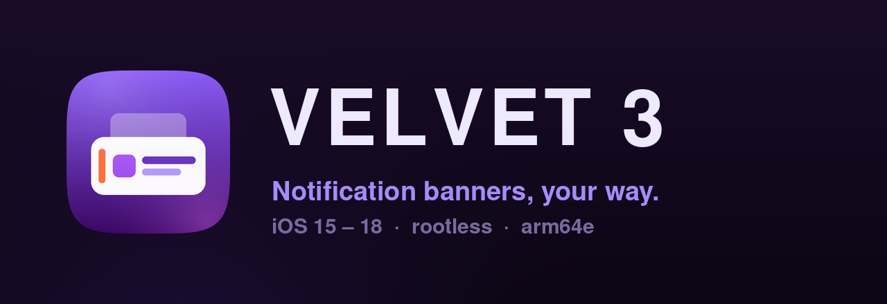

<p align="center">
  
</p>

<p align="center">
  <a href="https://github.com/belubruh123/Velvet3/releases/latest"></a>
  
  
  <a href="LICENSE"></a>
</p>

**Velvet 3** restyles iOS notification banners. Give them a colour pulled from the app's
own icon, round the corners the way you like, add a border, a glow, an accent line — and
then override any of it per app, so Messages doesn't have to look like Mail.

It runs on **iOS 15 through 18**, rootless, on A12 and newer.

---

## What you can change

| | |
|---|---|
| **Background** | solid colour, or auto-tinted from the app icon |
| **Border** | width and colour, independent of the background |
| **Line** | Velvet's accent stripe down the leading edge |
| **Glow** | coloured shadow behind the banner |
| **Title / Message / Date** | colour each label separately |
| **App icon** | hide it, or round it |
| **Corner radius** | including iOS's continuous ("squircle") curve |
| **Stack dimming** | turn off the dimming applied to stacked notifications |
| **Per-app** | any of the above, overridden for individual apps |

Everything lives in **Settings → Velvet 3**, with a live preview.

## Install

Grab the `.deb` from [Releases](https://github.com/belubruh123/Velvet3/releases/latest)
and install it with Sileo, Zebra, or `dpkg -i`. Respring when it asks.

Requires a rootless jailbreak with ElleKit or Substrate — Dopamine 3, palera1n rootless,
and similar. Remove Velvet 2 first if you have it; the two hook the same classes and must
not both load. Velvet 3 declares `Conflicts`/`Replaces` on it, so a package manager will
handle that for you.

## Safety

Notification tweaks live inside SpringBoard, where an uncaught exception is not an error
dialog — it is a dead UI, and twice in a row is safe mode. Velvet 3 is built so that
cannot happen:

- **Every** read of Apple's private view internals goes through
  [`src/VLTRuntime.m`](src/VLTRuntime.m), which returns `nil` when something is missing on
  your iOS version instead of raising. No styling always beats no SpringBoard.
- Hooks are grouped and installed **conditionally** — a class iOS no longer has simply
  never gets hooked.
- A **crash watchdog** in `%ctor` notices if SpringBoard died with Velvet loaded and
  disables the tweak, so a bad build costs one respring instead of an evening.
- A **kill switch**: create `/var/mobile/Library/Preferences/com.belubruh123.velvet3.disabled`
  (Filza works fine) and Velvet stays inert on the next respring.

If you ever need to dig into a new iOS version, there is a read-only
[recon mode](docs/DEVICE-SETUP.md) that dumps the real class names, ivars and view tree
without installing a single hook.

## Compatibility

| iOS | Status |
|---|---|
| 18.0 – 18.4 | Tested on A12 / Dopamine 3 |
| 17.x | Expected to work; untested |
| 15 – 16 | Supported, same as Velvet 2 |

Apple removed `prominentIcon` / `subordinateIcon` from the notification content view in
iOS 18, which is what broke every icon-derived colour in Velvet 2. Velvet 3 resolves the
icon from the `NCBadgedIconView` image view instead.

## Building

```bash
export THEOS=~/theos
make package FINALPACKAGE=1
python3 tools/check-slices.py packages/*.deb
```

> **Release builds must come from macOS.** A12+ devices run SpringBoard as arm64e, and the
> iOS 14+ arm64e ABI is only emitted by Apple's Xcode clang. Theos on Linux emits the
> pre-iOS-14 ABI, which iOS 15+ refuses to load — and dyld *prefers* the arm64e slice, so
> shipping a bad one breaks loading outright rather than falling back to arm64. Linux
> builds here are arm64-only; [`.github/workflows/build.yml`](.github/workflows/build.yml)
> produces the real package on macOS and `tools/check-slices.py` is the guard.

Logo assets are generated, not hand-drawn — run `python3 tools/make-logo.py` to rebuild
them from the geometry in that script.

New to tweak development? [`docs/TWEAK-DEV-PRIMER.md`](docs/TWEAK-DEV-PRIMER.md) explains
what a tweak actually is, how Logos and the ObjC runtime fit together, and why
`-valueForKey:` on a private ivar is the trap that put this project in safe mode.
[`docs/DEVICE-SETUP.md`](docs/DEVICE-SETUP.md) covers the install/log/respring loop.

## Credits

Velvet 3 continues [**Velvet 2** by NoisyFlake](https://github.com/NoisyFlake/Velvet2),
which stopped at iOS 16 in June 2023. The feature set, the preferences UI and most of the
styling logic are theirs; this project carries them forward to iOS 17/18 and rebuilds the
private-API layer so it fails soft. Colour extraction is ColorCube by Ole Krause-Sparmann.

MIT licensed — see [LICENSE](LICENSE), which keeps NoisyFlake's copyright.
